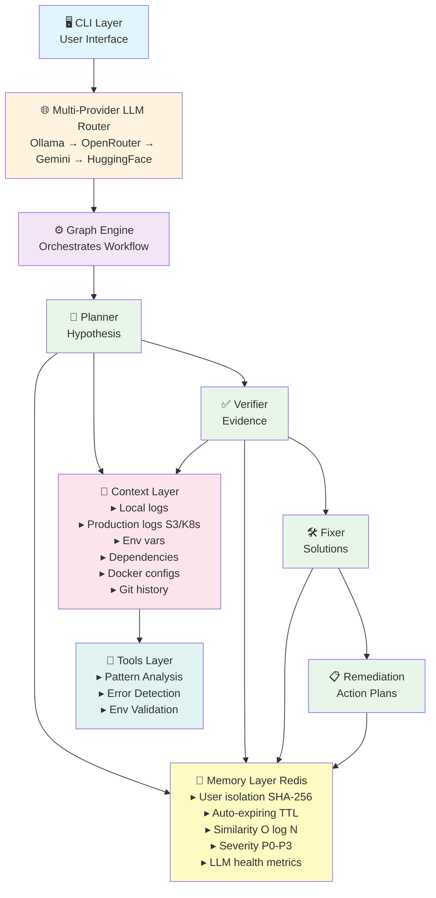

# OpsPilot-AI Architecture 🏗️

> Production-grade multi-agent AI system for autonomous incident analysis and resolution

<div align="center">

**Multi-Agent** • **Multi-Provider LLM** • **Redis Memory** • **Production-Ready**

[Overview](#-system-overview) • [Architecture](#-high-level-architecture) • [Agents](#-agent-system) • [LLM System](#-multi-provider-llm-system) • [Memory](#-redis-memory-system) • [Data Flow](#-complete-data-flow)

</div>

---

## 🎯 System Overview

OpsPilot-AI is a **production-grade incident analysis system** that uses specialized AI agents, multi-provider LLM routing, and Redis-based memory to automatically diagnose and resolve runtime issues with enterprise-level reliability.

### 🎨 Core Design Principles

```
┌─────────────────────────────────────────────────────────────────┐
│  Safety First      Evidence-Based    High Availability          │
│  Dry-run only      Confidence 0-1    Multi-provider fallback    │
│                                                                   │
│  User Isolation    Auto-Expiring     Production-Ready           │
│  SHA-256 hashing   30-day TTL        45+ tests, error handling  │
└─────────────────────────────────────────────────────────────────┘
```

---

## 🏗️ High-Level Architecture

### System Components



<details>
<summary>📊 Alternative Text-Based Diagram (click to expand)</summary>

```
┌─────────────────────────────────────────────────────────────┐
│                    🖥️  CLI LAYER                            │
│                   User Interface & Commands                  │
└──────────────────────────┬──────────────────────────────────┘
                           │
┌──────────────────────────▼──────────────────────────────────┐
│              🌐  MULTI-PROVIDER LLM ROUTER                   │
│   Ollama (local) → OpenRouter → Gemini → HuggingFace       │
│   ✓ Auto-failover  ✓ Health tracking  ✓ 100% FREE          │
└──────────────────────────┬──────────────────────────────────┘
                           │
┌──────────────────────────▼──────────────────────────────────┐
│                 ⚙️  GRAPH ENGINE                            │
│           State Management & Agent Orchestration             │
└──────────────────────────┬──────────────────────────────────┘
                           │
           ┌───────────────┼───────────────┬────────────┐
           │               │               │            │
           ▼               ▼               ▼            ▼
    ┌──────────┐   ┌──────────┐   ┌──────────┐  ┌──────────┐
    │ 🧠 Plan  │──▶│ ✅ Verify│──▶│ 🛠️ Fix  │─▶│ 📋 Remed │
    │  Agent   │   │  Agent   │   │  Agent   │  │  Agent   │
    │          │   │          │   │          │  │          │
    │Hypothesis│   │ Evidence │   │Solutions │  │3-Tier    │
    │ Gen      │   │ Collect  │   │DRY-RUN   │  │Plans     │
    └──────────┘   └──────────┘   └──────────┘  └──────────┘
           │               │               │            │
           └───────────────┴───────────────┴────────────┘
                           │
              ┌────────────┴────────────┐
              │                         │
              ▼                         ▼
    ┌──────────────────┐     ┌──────────────────┐
    │ 📂 CONTEXT LAYER │     │ 💾 MEMORY REDIS  │
    │                  │     │                  │
    │ ▸ Local logs     │     │ ▸ User isolated  │
    │ ▸ S3/K8s logs    │     │ ▸ TTL 30 days    │
    │ ▸ Env vars       │     │ ▸ Similarity O(log N)│
    │ ▸ Dependencies   │     │ ▸ Severity index │
    │ ▸ Docker cfg     │     │ ▸ Health metrics │
    │ ▸ Git history    │     │ ▸ File fallback  │
    └─────────┬────────┘     └──────────────────┘
              │
              ▼
    ┌──────────────────────────────────────┐
    │        🔧 TOOLS LAYER                │
    │                                      │
    │ ▸ Pattern Analysis (P0/P1/P2/P3)    │
    │ ▸ Log Error Detection                │
    │ ▸ Environment Validation             │
    │ ▸ Dependency Checking                │
    └──────────────────────────────────────┘
```
</details>

### 📊 Technology Stack Summary

| Layer | Technologies | Purpose |
|-------|-------------|---------|
| **Agents** | Python, Custom Multi-Agent System | Planner, Verifier, Fixer, Remediation |
| **LLM** | Ollama, OpenRouter, Gemini, HuggingFace | 100% FREE providers with auto-fallback |
| **Memory** | Redis (+ file fallback) | User-isolated, auto-expiring incident storage |
| **Context** | boto3, kubernetes, Git | Multi-source data ingestion |
| **CLI** | Typer, Rich | Production-grade terminal interface |
| **Testing** | pytest (45+ tests) | Comprehensive coverage |

---

## 📊 Complete Data Flow

<details open>
<summary><b>🔄 End-to-End Incident Analysis Workflow (click to collapse)</b></summary>

```
┌─────────────────────────────────────────────────────────────────────┐
│  USER INITIATES                                                     │
│  $ opspilot analyze --log-source s3://logs --deployment-analysis   │
└──────────────────────────┬──────────────────────────────────────────┘
                           │
                           ▼
┌──────────────────────────────────────────────────────────────────────┐
│  STEP 1: INITIALIZATION                                              │
│  ┌──────────────────────────────────────────────────────────────┐  │
│  │ • Load .env configuration                                     │  │
│  │ • Initialize multi-provider LLM router                        │  │
│  │ • Check Redis availability (fallback to file if needed)       │  │
│  │ • Detect project root and setup state                         │  │
│  └──────────────────────────────────────────────────────────────┘  │
└──────────────────────────┬──────────────────────────────────────────┘
                           │
                           ▼
┌──────────────────────────────────────────────────────────────────────┐
│  STEP 2: CONTEXT COLLECTION (Parallel)                               │
│  ┌─────────────────────┬─────────────────────┬───────────────────┐  │
│  │ Local Sources       │ Production Sources  │ Code Analysis     │  │
│  │ • Project logs      │ • S3 logs           │ • Git history     │  │
│  │ • .env files        │ • K8s pod logs      │ • Recent commits  │  │
│  │ • Dependencies      │ • CloudWatch logs   │ • Deployment time │  │
│  │ • Docker configs    │ • HTTP endpoints    │ • Changed files   │  │
│  └─────────────────────┴─────────────────────┴───────────────────┘  │
│  📊 Pattern Analysis: HTTP errors, exceptions, timeouts, DB errors   │
│  🚨 Severity Classification: P0/P1/P2/P3 based on error patterns    │
└──────────────────────────┬──────────────────────────────────────────┘
                           │
                           ▼
┌──────────────────────────────────────────────────────────────────────┐
│  STEP 3: MEMORY CHECK (Redis)                                        │
│  ┌──────────────────────────────────────────────────────────────┐  │
│  │ Query: Similar incidents in last 30 days (confidence ≥ 0.6)  │  │
│  │ Key: incidents:similar:{project_hash}                         │  │
│  │ Result: Show user matching past incidents if found           │  │
│  └──────────────────────────────────────────────────────────────┘  │
└──────────────────────────┬──────────────────────────────────────────┘
                           │
                           ▼
┌──────────────────────────────────────────────────────────────────────┐
│  STEP 4: 🧠 PLANNER AGENT                                            │
│  ┌──────────────────────────────────────────────────────────────┐  │
│  │ Input: Context (logs, env, deps, structure)                  │  │
│  │ LLM Call: Ollama/OpenRouter/Gemini/HuggingFace (auto-retry)  │  │
│  │ Output: {                                                     │  │
│  │   "hypothesis": "Redis timeout due to connection pooling",   │  │
│  │   "confidence": 0.8,                                          │  │
│  │   "possible_causes": ["No connection pool", "Network lag"],  │  │
│  │   "required_checks": ["Check Redis config", "Verify network"]│  │
│  │ }                                                             │  │
│  └──────────────────────────────────────────────────────────────┘  │
│  State Updated: hypothesis ✓  confidence ✓                          │
└──────────────────────────┬──────────────────────────────────────────┘
                           │
                           ▼
┌──────────────────────────────────────────────────────────────────────┐
│  STEP 5: EVIDENCE COLLECTION                                         │
│  ┌──────────────────────────────────────────────────────────────┐  │
│  │ • Analyze log errors (ERROR count, Timeout count)            │  │
│  │ • Check missing environment variables (REDIS_URL, etc.)      │  │
│  │ • Detect dependencies (uses Redis? uses PostgreSQL?)         │  │
│  │ • Pattern matching (HTTP 5xx, exceptions, memory errors)     │  │
│  └──────────────────────────────────────────────────────────────┘  │
│  Evidence: {"log_errors": {...}, "missing_env": [...], ...}         │
└──────────────────────────┬──────────────────────────────────────────┘
                           │
                           ▼
┌──────────────────────────────────────────────────────────────────────┐
│  STEP 6: ✅ VERIFIER AGENT                                           │
│  ┌──────────────────────────────────────────────────────────────┐  │
│  │ Input: Hypothesis + Evidence                                 │  │
│  │ LLM Call: Cross-reference hypothesis with evidence           │  │
│  │ Output: {                                                     │  │
│  │   "supported": true,                                          │  │
│  │   "confidence": 0.85,                                         │  │
│  │   "reason": "Log timeouts + missing REDIS_URL confirm issue" │  │
│  │ }                                                             │  │
│  └──────────────────────────────────────────────────────────────┘  │
│  State Updated: confidence 0.85 ✓  verdict: supported ✓            │
└──────────────────────────┬──────────────────────────────────────────┘
                           │
                      Confidence ≥ 0.6?
                           │
                   ┌───────┴───────┐
                   │ YES           │ NO
                   ▼               ▼
        ┌──────────────────┐  ┌──────────────────┐
        │ Continue to Fix  │  │ Terminate        │
        └────────┬─────────┘  │ (Low confidence) │
                 │             └──────────────────┘
                 ▼
┌──────────────────────────────────────────────────────────────────────┐
│  STEP 7: 🛠️ FIXER AGENT (if confidence ≥ 0.6)                       │
│  ┌──────────────────────────────────────────────────────────────┐  │
│  │ Strategy 1: Template-based fixes (Redis, PostgreSQL, etc.)   │  │
│  │ Strategy 2: LLM-generated custom fixes (if no template)      │  │
│  │ Output: {                                                     │  │
│  │   "suggestions": [                                            │  │
│  │     {                                                         │  │
│  │       "file": ".env",                                         │  │
│  │       "diff": "--- a/.env\n+++ b/.env\n+REDIS_TIMEOUT=5",    │  │
│  │       "rationale": "Increase timeout to handle network lag"  │  │
│  │     }                                                         │  │
│  │   ]                                                           │  │
│  │ }                                                             │  │
│  └──────────────────────────────────────────────────────────────┘  │
│  🔒 SAFETY: All fixes are DRY-RUN only, shown as diffs              │
└──────────────────────────┬──────────────────────────────────────────┘
                           │
                           ▼
┌──────────────────────────────────────────────────────────────────────┐
│  STEP 8: 📋 REMEDIATION AGENT                                        │
│  ┌──────────────────────────────────────────────────────────────┐  │
│  │ Input: Severity (P0/P1/P2/P3) + Error patterns + Evidence    │  │
│  │ Output: {                                                     │  │
│  │   "immediate_actions": [                                      │  │
│  │     "Restart Redis service",                                  │  │
│  │     "Verify REDIS_URL in .env"                                │  │
│  │   ],                                                          │  │
│  │   "short_term_fixes": [                                       │  │
│  │     "Add connection pooling (max_connections=20)",            │  │
│  │     "Increase socket_timeout=5"                               │  │
│  │   ],                                                          │  │
│  │   "long_term_improvements": [                                 │  │
│  │     "Setup Redis Sentinel for HA",                            │  │
│  │     "Implement circuit breaker pattern"                       │  │
│  │   ],                                                          │  │
│  │   "verification_steps": [                                     │  │
│  │     "Monitor error rate drops to <1%",                        │  │
│  │     "Verify Redis response time <100ms"                       │  │
│  │   ]                                                           │  │
│  │ }                                                             │  │
│  └──────────────────────────────────────────────────────────────┘  │
└──────────────────────────┬──────────────────────────────────────────┘
                           │
                           ▼
┌──────────────────────────────────────────────────────────────────────┐
│  STEP 9: SAVE TO MEMORY (Redis)                                      │
│  ┌──────────────────────────────────────────────────────────────┐  │
│  │ Key: incident:{project_hash}:{timestamp}                      │  │
│  │ TTL: 30 days (auto-expire)                                    │  │
│  │ Indexes:                                                      │  │
│  │  • incidents:similar:{hash} (sorted by confidence)            │  │
│  │  • incidents:severity:{hash}:P1                               │  │
│  │ LLM Metrics:                                                  │  │
│  │  • llm:health:OllamaProvider (success/failure/latency)        │  │
│  └──────────────────────────────────────────────────────────────┘  │
└──────────────────────────┬──────────────────────────────────────────┘
                           │
                           ▼
┌──────────────────────────────────────────────────────────────────────┐
│  STEP 10: DISPLAY RESULTS                                            │
│  ┌──────────────────────────────────────────────────────────────┐  │
│  │ Terminal Output (Rich formatting):                            │  │
│  │ ✓ Hypothesis: Redis timeout (confidence 0.85)                │  │
│  │ ✓ Severity: P1                                                │  │
│  │ ✓ Evidence: 15 timeout errors, missing REDIS_URL             │  │
│  │ ✓ Fixes: 2 suggested (view diffs)                            │  │
│  │ ✓ Remediation: Immediate + short-term + long-term plans      │  │
│  │                                                               │  │
│  │ JSON Output (if --json flag):                                │  │
│  │ {"hypothesis": ..., "confidence": ..., "fixes": [...]}       │  │
│  └──────────────────────────────────────────────────────────────┘  │
└──────────────────────────────────────────────────────────────────────┘
                           │
                           ▼
                    ✅ COMPLETE
           User reviews and applies fixes manually
```

</details>

### ⏱️ Performance Characteristics

| Operation | Complexity | Latency | Notes |
|-----------|-----------|---------|-------|
| Redis similarity search | O(log N) | <10ms | Sorted set query |
| Redis severity filter | O(1) | <5ms | Set membership |
| LLM inference (Ollama) | - | 2-5s | Local, depends on prompt |
| LLM inference (Cloud) | - | 1-3s | Network latency |
| Context collection | - | 1-3s | Parallel file I/O |
| Complete analysis | - | 10-30s | End-to-end with LLM calls |

---

## 🤖 Agent System

### Workflow States

1. **Initial State**: Empty state with only `project_root`
2. **Context Collected**: State populated with logs, env, deps, etc.
3. **Hypothesis Formed**: Planner adds hypothesis and initial confidence
4. **Evidence Gathered**: Verifier collects concrete evidence
5. **Hypothesis Verified**: Verifier updates confidence based on evidence
6. **Fixes Suggested** (if confidence ≥ 0.6): Fixer generates suggestions
7. **Terminal State**: Workflow completes

---

## Agent Design

### 1. Planner Agent (`agents/planner.py`)

**Responsibility**: Analyze project context and generate hypotheses about root causes

**Input**: Project context (logs, env vars, dependencies, structure)

**Output**:
```json
{
  "hypothesis": "Redis connection issue caused by network timeout",
  "confidence": 0.8,
  "possible_causes": ["Network latency", "Redis server down"],
  "required_checks": ["Verify Redis connectivity", "Check network logs"]
}
```

**LLM Prompt Strategy**:
- Role: Senior Site Reliability Engineer
- Task: Analyze context and form hypothesis
- Output: Strict JSON format (no explanatory text)
- Context Summarization: Limits logs to 2000 chars, deps to 20 items (token optimization)

**Key Features**:
- Context summarization to reduce LLM token usage
- Robust JSON extraction (handles LLM adding explanatory text)
- 120-second timeout with error handling

---

### 2. Verifier Agent (`agents/verifier.py`)

**Responsibility**: Validate hypotheses using concrete evidence

**Input**:
- Hypothesis from Planner
- Evidence collected from tools

**Output**:
```json
{
  "supported": true,
  "confidence": 0.8,
  "reason": "Log errors and Redis usage confirm connection issue"
}
```

**Evidence Types**:
- `log_errors`: Error counts by type (ERROR, Timeout, Exception)
- `missing_env`: Required environment variables not found
- `uses_redis`: Boolean flag for Redis dependency
- More evidence types can be added via tools

**Decision Logic**:
- Confidence ≥ 0.6 → Proceed to Fixer
- Confidence < 0.6 → Terminate workflow (not enough certainty)

---

### 3. Fixer Agent (`agents/fixer.py`)

**Responsibility**: Generate safe, actionable fix suggestions

**Input**:
- Hypothesis
- Evidence

**Output**:
```json
{
  "suggestions": [
    {
      "file": ".env",
      "diff": "--- a/.env\n+++ b/.env\n-REDIS_TIMEOUT=1\n+REDIS_TIMEOUT=5",
      "rationale": "Increase timeout to reduce transient errors"
    }
  ]
}
```

**Fix Strategy**:
1. **Domain-Specific Fixes** (hardcoded templates)
   - Redis timeout adjustment
   - Redis connection pooling
   - More domains can be added (PostgreSQL, MongoDB, etc.)

2. **LLM-Generated Fixes** (fallback)
   - If no template matches, use LLM to generate custom suggestions
   - Output as unified diff format

**Safety Guarantees**:
- All fixes shown as diffs (preview before apply)
- Rationale provided for each suggestion
- User must manually apply changes

---

### 4. Remediation Agent (`agents/remediation.py`)

**Responsibility**: Generate comprehensive 3-tier action plans

**Input**:
- Severity level (P0/P1/P2/P3)
- Error patterns
- Evidence

**Output**:
```json
{
  "immediate_actions": [
    "Restart Redis service",
    "Check Redis server logs for errors"
  ],
  "short_term_fixes": [
    "Increase Redis timeout to 5 seconds",
    "Enable connection pooling (max 20 connections)"
  ],
  "long_term_improvements": [
    "Set up Redis cluster for high availability",
    "Implement circuit breaker pattern"
  ],
  "verification_steps": [
    "Monitor error rate after changes",
    "Verify Redis response times < 100ms"
  ]
}
```

**Strategy**:
- **Immediate**: Actions to take right now (P0/P1 incidents)
- **Short-term**: Fixes to apply within hours/days
- **Long-term**: Architectural improvements for prevention
- **Verification**: How to confirm the issue is resolved

---

## Multi-Provider LLM System

### Architecture

OpsPilot uses a **router-based multi-provider system** with automatic fallback:

```python
LLMRouter
├── OllamaProvider (local, priority 1)
│   ├── Health check: ollama list
│   ├── Model: llama3
│   └── Timeout: 60s
├── OpenRouterProvider (cloud, priority 2)
│   ├── Health check: API key present
│   ├── Model: google/gemini-2.0-flash-exp:free
│   └── Timeout: 60s
├── GeminiProvider (cloud, priority 3)
│   ├── Health check: API key present
│   ├── Model: gemini-2.0-flash
│   └── Timeout: 60s
└── HuggingFaceProvider (cloud, priority 4)
    ├── Health check: API key present
    ├── Model: mistralai/Mixtral-8x7B-Instruct-v0.1
    └── Timeout: 60s
```

### Fallback Logic

```python
def call(prompt: str, timeout: int) -> str:
    errors = []

    # Try last successful provider first (sticky routing)
    if self.last_successful_provider:
        try:
            return self.last_successful_provider.call(prompt)
        except Exception as e:
            errors.append(f"{provider}: {e}")

    # Try all available providers in order
    for provider in self.providers:
        if not provider.is_available():
            continue

        try:
            result = provider.call(prompt)
            self.last_successful_provider = provider  # Remember success
            return result
        except Exception as e:
            errors.append(f"{provider}: {e}")
            continue

    # All providers failed
    raise RuntimeError(f"All LLM providers failed:\n{errors}")
```

### Provider Health Tracking

The system tracks LLM provider health metrics in Redis:

```python
# Per-provider metrics
redis.hset("llm:health:OllamaProvider", {
    "success_count": 142,
    "failure_count": 3,
    "avg_latency_ms": 234.5,
    "last_success": 1736704800
})
```

### Configuration

Users can control provider preference via environment variables:

```bash
# Prefer local over cloud (default: true)
OPSPILOT_PREFER_LOCAL=true

# LLM inference timeout (default: 60s)
OPSPILOT_LLM_TIMEOUT=60

# API keys for cloud providers (optional)
OPENROUTER_API_KEY=sk-or-v1-...
GOOGLE_API_KEY=...
HUGGINGFACE_API_KEY=hf_...
```

---

## Redis-Based Memory System

### User Isolation Strategy

**Problem**: Multiple users/projects must not see each other's incidents

**Solution**: SHA-256 project path hashing

```python
def _get_project_hash(project_root: str) -> str:
    return hashlib.sha256(project_root.encode()).hexdigest()[:16]

# User 1: /home/alice/app → hash: a1b2c3d4e5f6g7h8
# User 2: /home/bob/app   → hash: x9y8z7w6v5u4t3s2

# Complete key isolation
incident:a1b2c3d4:1234567890  # Alice's incident
incident:x9y8z7w6:1234567890  # Bob's incident
```

### Redis Schema Design

```python
# 1. Individual incidents (auto-expire after TTL)
Key:   incident:{project_hash}:{timestamp}
Value: JSON {hypothesis, confidence, severity, evidence, ...}
TTL:   2592000 seconds (30 days, configurable)

# 2. Similarity index (sorted set by confidence)
Key:    incidents:similar:{project_hash}
Score:  confidence (0.0 - 1.0)
Member: incident_key
TTL:    2592000 seconds

# 3. Severity index (set per severity level)
Key:   incidents:severity:{project_hash}:{P0/P1/P2/P3}
Value: Set of incident_keys
TTL:   2592000 seconds

# 4. LLM provider health (global, shared)
Key:   llm:health:{provider_name}
Value: Hash {success_count, failure_count, avg_latency_ms}
TTL:   3600 seconds (1 hour)
```

### Why TTL-Based Expiration?

**Problem**: PostgreSQL would accumulate fixed incidents forever

**Solution**: Redis TTL automatically expires old data

```python
# Incident stored with TTL
redis.setex(
    key=f"incident:{project_hash}:{timestamp}",
    time=OPSPILOT_REDIS_TTL_DAYS * 24 * 60 * 60,  # Default: 30 days
    value=json.dumps(incident_data)
)

# After 30 days: Redis automatically deletes the key
# No cleanup jobs needed, no stale data accumulation
```

### Performance Characteristics

```python
# Similarity search: O(log N) with sorted sets
similar = redis.zrevrangebyscore(
    f"incidents:similar:{project_hash}",
    max=1.0,
    min=0.6,
    start=0,
    num=5
)
# Returns top 5 similar incidents in <10ms

# Severity filter: O(1) with set membership
p0_incidents = redis.smembers(f"incidents:severity:{project_hash}:P0")
# Returns all P0 incidents in <5ms
```

### Graceful Degradation

```python
try:
    redis_memory = RedisMemory()
    if not redis_memory.health_check():
        raise RuntimeError("Redis unavailable")
except Exception:
    # Fallback to file-based memory
    print("[INFO] Using file-based memory (Redis unavailable)")
    from opspilot.memory import load_memory, save_memory
    # System continues working with file-based storage
```

---

## Data Flow

### Complete Execution Flow

```
User runs: opspilot analyze
          │
          ▼
┌─────────────────────────┐
│  1. Initialize State    │
│     (project_root)      │
└──────────┬──────────────┘
           │
           ▼
┌─────────────────────────┐
│  2. Collect Context     │
│     - Scan logs         │
│     - Read .env         │
│     - Parse deps        │
│     - Check Docker      │
│     - Map structure     │
└──────────┬──────────────┘
           │
           ▼
┌─────────────────────────┐
│  3. Planner Agent       │
│     - Summarize context │
│     - Call LLM          │
│     - Extract JSON      │
│     - Form hypothesis   │
└──────────┬──────────────┘
           │
           ▼
┌─────────────────────────┐
│  4. Collect Evidence    │
│     - Analyze logs      │
│     - Check env vars    │
│     - Detect deps       │
└──────────┬──────────────┘
           │
           ▼
┌─────────────────────────┐
│  5. Verifier Agent      │
│     - Match evidence    │
│     - Update confidence │
│     - Decide next step  │
└──────────┬──────────────┘
           │
           ▼
      Confidence ≥ 0.6?
           │
    ┌──────┴──────┐
    │ YES         │ NO
    ▼             ▼
┌─────────────┐  ┌─────────────┐
│ 6. Fixer    │  │ 7. Terminate│
│    Agent    │  │    (Low     │
│    - Gen    │  │  Confidence)│
│      fixes  │  └─────────────┘
└──────┬──────┘
       │
       ▼
┌─────────────────────────┐
│  8. Save to Memory      │
│     (~/.opspilot_mem)   │
└──────────┬──────────────┘
           │
           ▼
    Display Results
```

---

## State Management

### AgentState Dataclass

```python
@dataclass
class AgentState:
    project_root: str
    context: Dict[str, Any] = field(default_factory=dict)
    hypothesis: Optional[str] = None
    confidence: float = 0.0
    evidence: Dict[str, Any] = field(default_factory=dict)
    suggestions: List[Dict[str, Any]] = field(default_factory=list)
    checks_remaining: List[str] = field(default_factory=list)
    iteration: int = 0
    terminated: bool = False
```

### State Transitions

Each agent is implemented as a **pure function** that takes state and returns updated state:

```python
def planner_node(state: AgentState) -> AgentState:
    result = plan(state.context)
    state.hypothesis = result.get("hypothesis")
    state.confidence = result.get("confidence", 0.0)
    state.iteration += 1
    return state

def verifier_node(state: AgentState) -> AgentState:
    state.evidence = collect_evidence(state.context)
    verdict = verify(state.hypothesis, state.evidence)
    state.confidence = verdict.get("confidence", state.confidence)
    return state

def fixer_node(state: AgentState) -> AgentState:
    if state.confidence >= CONFIDENCE_THRESHOLD:
        fixes = suggest(state.hypothesis, state.evidence)
        state.suggestions = fixes.get("suggestions", [])
    return state
```

### Workflow Termination

The workflow terminates when:
1. Confidence ≥ 0.6 and fixes are generated, OR
2. Confidence < 0.6 (insufficient evidence), OR
3. Maximum iterations reached (safety limit)

---

## LLM Integration

### Multi-Provider Strategy

OpsPilot uses a **router-based multi-provider system** with automatic fallback (see [Multi-Provider LLM System](#multi-provider-llm-system) section above for details).

**Why Multi-Provider?**
- ✅ **High Availability**: Automatic failover if one provider is down
- ✅ **Cost Optimization**: Prefer free local inference (Ollama)
- ✅ **Flexibility**: All providers use FREE tiers (no API costs)
- ✅ **Privacy Options**: Can run 100% offline with Ollama only
- ✅ **Vendor Independence**: Not locked into single provider

### Prompt Engineering Techniques

#### 1. Structured Output Prompting
```python
SYSTEM_PROMPT = """
You are a senior site reliability engineer.
Your task is to analyze project context and form a hypothesis.

CRITICAL: Your response must be ONLY valid JSON with this exact format:
{
  "hypothesis": "...",
  "confidence": 0.0,
  "possible_causes": ["..."],
  "required_checks": ["..."]
}

Do not include any text before the opening { or after the closing }.
"""
```

#### 2. Context Summarization (Token Optimization)
```python
summarized_context = {
    "logs": context.get("logs", "")[:2000],           # Limit to 2000 chars
    "env": list(context.get("env", {}).keys()),      # Only var names
    "dependencies": context.get("dependencies", [])[:20],  # Top 20
    "structure": str(context.get("structure", ""))[:1000]  # Limit
}
```

#### 3. Robust JSON Extraction
```python
# LLMs often add explanatory text before/after JSON
# Extract JSON between first { and last }
start_idx = raw_output.find('{')
end_idx = raw_output.rfind('}')
if start_idx != -1 and end_idx != -1:
    json_str = raw_output[start_idx:end_idx + 1]
    result = json.loads(json_str)
```

#### 4. Error Handling & Timeouts
- 120-second timeout per LLM call (prevents hanging)
- Fallback responses on JSON parsing errors
- Informative error messages for debugging

---

## Design Decisions

### Why Multi-Agent Instead of Single LLM Call?

**Pros**:
- ✅ **Separation of concerns**: Each agent has a focused task
- ✅ **Easier to debug**: Can inspect state between agents
- ✅ **Modular**: Can replace/upgrade individual agents
- ✅ **Testable**: Each agent can be tested independently
- ✅ **Iterative refinement**: Can add feedback loops later

**Cons**:
- ❌ More LLM calls (higher latency)
- ❌ More complex state management

**Decision**: Multi-agent for maintainability and extensibility

---

### Why Confidence Threshold = 0.6?

**Rationale**:
- Too low (0.4): Generates fixes with weak evidence (risky)
- Too high (0.8): Rarely generates fixes (not helpful)
- 0.6: Balanced - requires moderate evidence strength

**Tunable**: Can be made configurable in future versions

---

### Why Dry-Run Only (No Auto-Apply)?

**Safety-Critical Decision**:
- Automatically applying code changes is dangerous
- User should review and approve all changes
- Builds trust in the system
- Easier to debug if something goes wrong

**Trade-off**: Less automated, but much safer

---

### Why Multi-Provider LLM System?

**Pros**:
- ✅ High availability (automatic failover)
- ✅ Zero cost (all providers use FREE tiers)
- ✅ Privacy option (can use Ollama only)
- ✅ Vendor independence (not locked in)
- ✅ No single point of failure

**Cons**:
- ❌ More complex implementation
- ❌ Requires API key management

**Decision**: Multi-provider for reliability while maintaining free/open-source principles

---

### Why Redis Over PostgreSQL for Memory?

**Redis Pros**:
- ✅ Auto-expiring data (TTL) - no stale incidents
- ✅ Sub-second lookups (critical for incident response)
- ✅ Simple key-value schema (no migrations)
- ✅ In-memory speed (perfect for real-time)
- ✅ Built-in sorted sets for similarity search

**PostgreSQL Cons**:
- ❌ Would accumulate fixed incidents forever
- ❌ Requires cleanup jobs for old data
- ❌ Slower for simple lookups
- ❌ Schema migrations needed

**Decision**: Redis for hot data (30 days), can add PostgreSQL later for long-term analytics if needed

---

## Future Enhancements

### Completed Features ✅

- ✅ **Multi-Provider LLM Support**: Ollama, OpenRouter, Gemini, HuggingFace with automatic fallback
- ✅ **Redis-Based Memory**: User-isolated storage with auto-expiring TTL
- ✅ **Severity Classification**: P0/P1/P2/P3 incident prioritization
- ✅ **Production Log Fetching**: S3, Kubernetes, CloudWatch integration
- ✅ **Deployment Correlation**: Git-based deployment history analysis
- ✅ **Comprehensive Testing**: 45+ unit tests with pytest

### Planned Improvements

#### 1. **Plugin System**
```python
# Allow users to register custom agents
opspilot.register_agent("my_custom_agent", MyAgentClass)

# Allow custom evidence collectors
opspilot.register_tool("my_evidence_tool", my_tool_function)
```

#### 2. **Web API Layer**
```python
# FastAPI endpoint
POST /api/analyze
{
  "project_path": "/path/to/project",
  "options": {
    "confidence_threshold": 0.7
  }
}
```

#### 3. **Feedback Loop (Self-Improvement)**
```python
# Agent can re-run if confidence is low
while state.confidence < 0.6 and state.iteration < max_iterations:
    state = collect_more_evidence(state)
    state = verifier_node(state)
```

#### 4. **Real-Time Metrics Dashboard**
- Track success rate of hypotheses
- Measure confidence accuracy
- Monitor LLM response times
- Visualize incident trends over time
- Provider health monitoring UI

#### 5. **Incident Alert Integration**
- Slack notifications for P0/P1 incidents
- PagerDuty integration
- Custom webhook support
- Email alerts with incident summary

#### 6. **Advanced Evidence Collection**
- API endpoint testing
- Database query analysis
- Network connectivity checks
- Resource usage metrics

#### 7. **Domain-Specific Agents**
- PostgreSQL expert agent
- MongoDB expert agent
- Kubernetes expert agent
- AWS/Cloud infrastructure agent

---

## Summary

OpsPilot's architecture is designed for:
- ✅ **Safety**: Dry-run only, evidence-based decisions
- ✅ **High Availability**: Multi-provider LLM with automatic failover
- ✅ **Modularity**: Easy to extend with new agents/tools
- ✅ **Transparency**: Clear state transitions, confidence scores, severity classification
- ✅ **Privacy-Focused**: Prefers local LLM with optional cloud fallback
- ✅ **Production-Ready**: Redis memory with user isolation, auto-expiring TTL
- ✅ **Scalability**: Sub-second incident lookups, severity indexing
- ✅ **Reliability**: Robust error handling, timeouts, graceful degradation
- ✅ **Vendor Independence**: 100% free/open-source providers, no lock-in

The multi-agent pattern combined with multi-provider LLM routing and Redis-based memory provides a robust, production-ready foundation for intelligent DevOps automation.

---

**For more details, see:**
- [README.md](README.md) - User guide and quick start
- [Contributing Guidelines](CONTRIBUTING.md) *(coming soon)*
- [API Documentation](docs/api.md) *(coming soon)*
